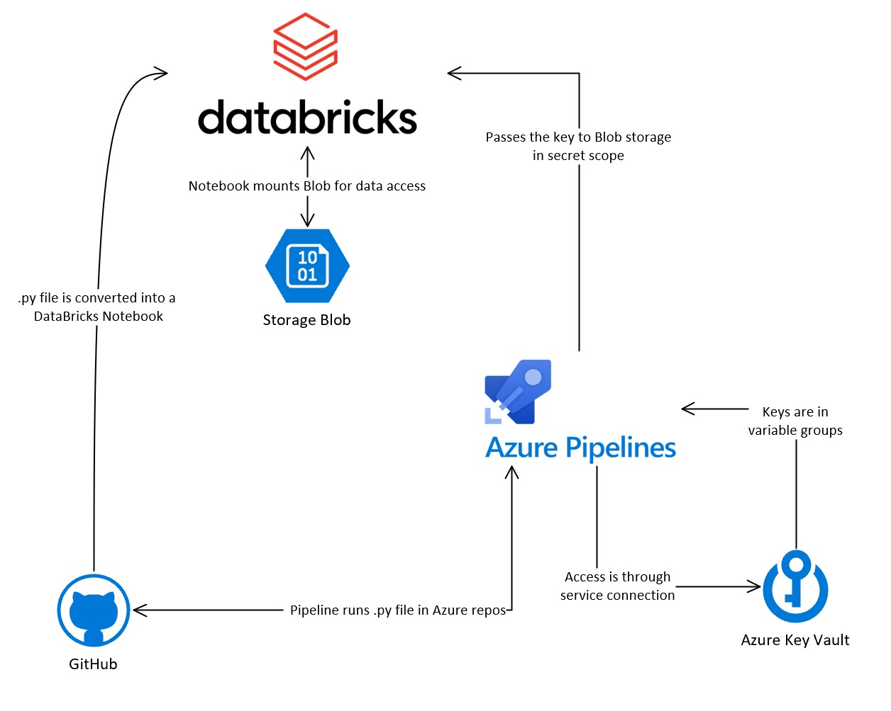

# azure-devops-databricks-accelerator

## File Structure
```azure-pipelines.yml```: this file contains the steps that run when the pipeline is triggered <br />
```main.py```: this file contains a script that converts a python file into a notebook in Azure Databricks<br />
```mount.py```: this file containts the scripts in the notebook to be deployed. The script here mounts a container from Azure storage. <br />

## Architecture
The end result of the accelerator will have the following structure:


## Walkthrough (Documentation)